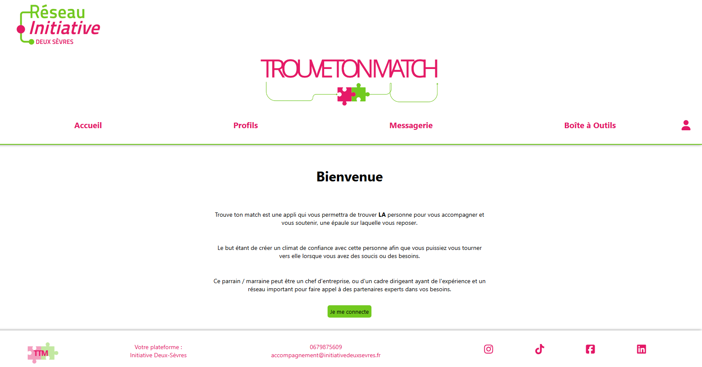
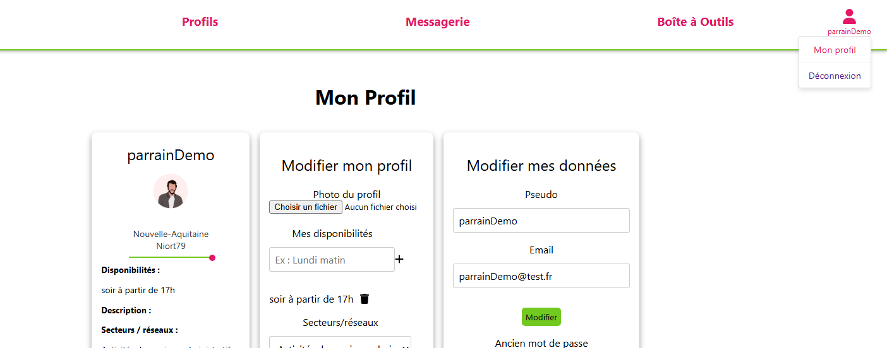
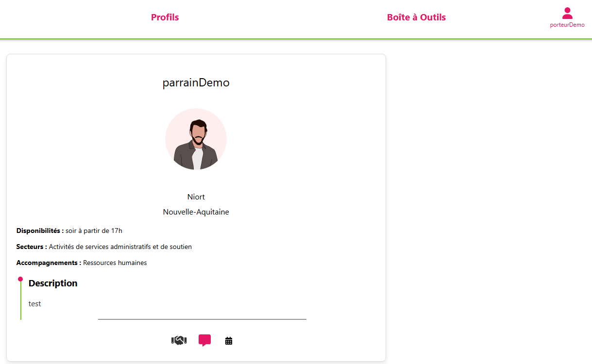
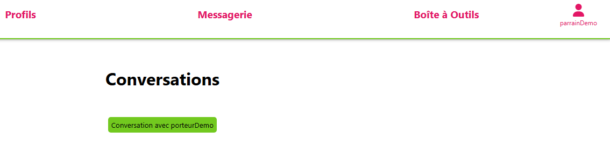

# Lancement du projet #

## Environnement##
java 21
Node 18

## Récupération du projet ##
Le repository est, pour l'instant, public.
Afin de contribuer au projet il est possible de cloner celui-ci
git clone + (lien https en appuyant sur le bouton vert "<> code")

Il est possible également le forker (Attention il faudra alors modifier le workflow de déploiement pour le relier à un nouveau domaine d'hébergement). 

## Lancer l'application backend ##
Le backend est une application spring boot avec le gestionnaire de package Gradle connecté
à une base de donnée postgres "ttm" (à créer en local)
- ouvrir le projet dans un editeur de code.
- En commande de terminal lancer l'application avec cette ligne :
./gradlew bootrun
- afin de tester les endopoints, se loger avec un user existant et récupérer la valeur du JWT pour renseigner le header des autres requetes HTTP :
- key : JWT et value : "valeur générée lors du login"

## Lancer l'application frontend ##
Le frontend est une application react qui se lance à partir du chemin suivant (après avoir lancer le back) :
- cd src/main/webapp 
- npm run dev

## Gestion des branches ##
Pour contribuer au projet :
- créer une branche de développement à partir de develop
- proposer une PR 

A la validation de la PR :
- une pipline teste le code et le valide 

Si la PR est validée et mergée sur develop :
- une nouvelle PR est faite pour la branche main

Au push sur main :
- une nouvelle version de release est crée, 
- le projet est buildé et les images docker sont mises à jour et pushées dans le container distant 
- le projet est déployé pour être publié

## Entrer dans l'application ##

Seul un administrateur peut créer des comptes. 

Le pseudo et mot de passe du premier administrateur peut être transmis sur demande à Sandrine Faucher.

## Page d'accueil ##

je me connecte 

## Page des profils ##

En fonction de mon role je vois différents profils :
- si je suis porteur de projet je vois les parrains,
- si je suis parrain je vois les porteurs de projets,
- si je suis user ou admin je vois tout le monde

- remplir son profil :

## Matchs & messagerie ##
- si je suis porteur de projet je clic sur l'icone poignée de main de la carte d'un parrain pour créer un match et avoir accès à l'icone de messagerie,

- si je suis parrain je clique sur le lien Messagerie dans la navigation pour entrer dans mes conversations avec les porteurs de projet.

